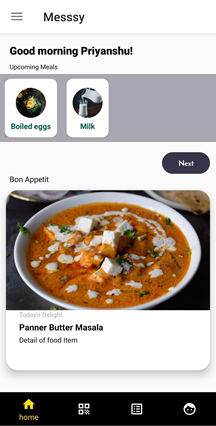
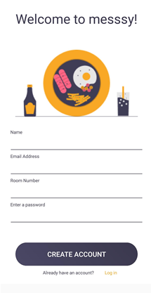
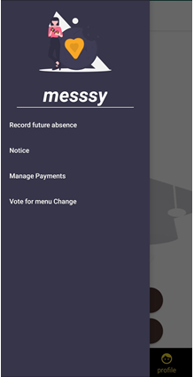
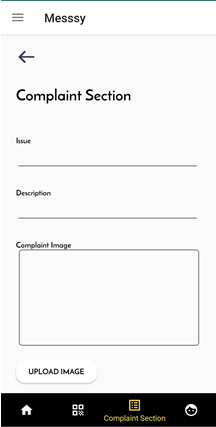

<h1 align="center">Messsy</h1>

An android app that helps automate the various tasks that are carried out by mess management and attendees! 🎉 
Each student can create his/her own profile by registering on the app using an email id and room number. The mess management provides the list of upcoming meals that are shown on student’s feeds. 
Features of Messsy- 
🌟 Record future absence - The attendee can inform the management about their future absence through this so that there won’t be any wastage of food and the money can be compensated.  
🌟 Notice - This section contains notices regarding mess timing, changes in the menu, etc. 
🌟 Manage Payments - All details of the payments done or due will be shown in this section. 
🌟 Vote for menu change - Addition or removal of any item from breakfast, lunch, or dinner can be voted here. 
🌟 Complaint section - If any attendee faces any problems then he/she can inform the management. They can complain about their issue with the description and also upload images (if any). 
🌟 e-Coupon - Just scan the QR code and use the e-Coupons available. 

<h2> Screenshots</h2> 

  
   
  
   
  

## Contributing

*This application is under active development and v1 is on the schedule. Head over to the [open issues](https://github.com/hackslash-nitp/messsy/issues) and see if you can pick something up if you want to contribute!* 👨‍💻

If you have suggestions for how Messsy could be improved, or want to report a bug, open an issue! We'd love all and any contributions.

For more, check out the [Contributing Guide](CONTRIBUTING.md).

## License

[ISC](LICENSE) © 2020 hackslash-nitp <hackslash.nitp@gmail.com>

<h2>  Contributors</h2> 

Made with [contributors-img](https://contrib.rocks).
###### ❤️ Thanks to our awesome contributors.

